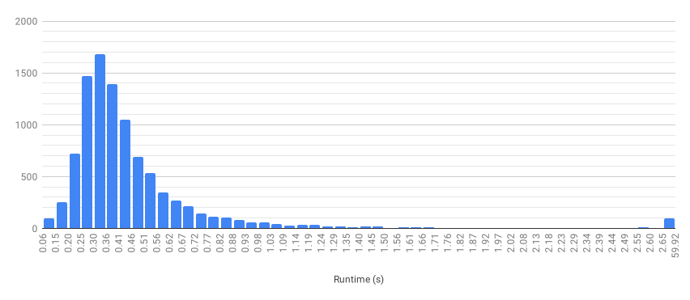

# How fast is CHOpt

CHOpt is now fast enough that I can throw multiple setlists at it, so for fun I
decided to do so and see what results come up. Don't take this too seriously:
for one I only ran this on all these songs once. I did this with CHOpt 1.2.1.

## The songs

I ran CHOpt on every song from the following setlists and packs with Expert
Lead Guitar, except Classical Thump, Dawn Patrol, Imagine, and Space Cowboy for
which I did Expert Bass.

* Angevil Hero II
* Anti Hero
* Anti Hero: Beach Episode
* Anti Hero: Beach Episode - The Beach Sides
* Anti Hero 2
* Band Hero
* Blanket Statement
* Brand New Hero
* Carpal Tunnel Hero: Remastered
* Carpal Tunnel Hero 2
* CHARTS
* CHARTS 2
* CHARTS 2 DLC (Pack 1)
* Circuit Breaker
* Cow Hero
* CSC Monthly Packs (June 2018 - December 2020)
* DF Discography CH
* Digitizer
* Dissonance Hero
* DJ Hero
* Djent Hero Collection (Pack #1 - Pack #5)
* DJMax Packs (Pack I - Pack II)
* Facelift (Pack 1 - Pack 2)
* Focal Point
* Focal Point 2
* GaMetal Power Pack
* Green Day Rock Band
* Guitar Hero
* Guitar Hero II
* Guitar Hero II DLC
* Guitar Hero Encore: Rocks the 80s
* Guitar Hero III: Legends of Rock
* Guitar Hero III: Legends of Rock DLC
* Guitar Hero: Aerosmith
* Guitar Hero World Tour
* Guitar Hero World Tour DLC
* Guitar Hero: Metallica
* Guitar Hero: Metallica DLC
* Guitar Hero Smash Hits
* Guitar Hero: Van Halen
* Guitar Hero 5
* Guitar Hero 5 DLC
* Guitar Hero: Warriors of Rock
* Guitar Hero: Warriors of Rock DLC
* Guitar Hero On Tour
* Guitar Hero On Tour: Decades
* Guitar Hero On Tour: Modern Hits
* Guitar Hero: Guitar Zero
* Guitar Hero: Guitar Zero DLC (DLC #1 - DLC #9)
* Guitar Hero X
* Koreaboo Hero
* Koreaboo Hero 2
* Lego Rock Band
* Marathon Hero
* Paradigm
* Phase Shift Guitar Project 4
* Redemption Arc
* Rock Band
* Rock Band 2
* Rock Band 3
* Rock Band ACDC Live Track Pack
* Rock Band Blitz
* The Beatles Rock Band
* The Fall of Troy Hero
* Trunks252JM's Classic Charts
* Verified Unverified
* Vortex Hero
* Zero Gravity

If there's a setlist or pack you'd like to see on here, let me know.

## Results

### Overall

The combined runtime was 56m18s. Below is a histogram of the runtime for each
song, with the top 1% combined as outliers.

The 25 slowest songs are as follows:

| Song                                             | Setlist                      | Time (s) |
| ------------------------------------------------ | ---------------------------- | -------- |
| CHARTS 2: Endless Setlist                        | CHARTS 2                     | 45.070   |
| CHARTS: The (almost) Endless Setlist             | CHARTS                       | 29.801   |
| Endless Setlist: The Fall of Troy Hero           | The Fall of Troy Hero        | 18.165   |
| Uranoid                                          | CHARTS                       | 11.485   |
| Chezy's Ultimate Solo Experience                 | CHARTS 2                     | 11.147   |
| The Human Equation                               | Marathon Hero                | 8.142    |
| Catch Thirtythree                                | Djent Hero Collection        | 6.880    |
| Eskapist                                         | CHARTS                       | 5.965    |
| Eskapist                                         | Marathon Hero                | 5.956    |
| Automata                                         | Marathon Hero                | 5.824    |
| Periphery IV: Hail Stan (Full Album)             | CHARTS 2                     | 5.417    |
| Coma Witch (Full Album Chart)                    | CHARTS                       | 5.174    |
| Volition (Full Album Chart)                      | CHARTS                       | 5.108    |
| Extreme Power Metal (Full Album)                 | Guitar Hero: Guitar Zero DLC | 4.857    |
| Nothing More [FULL ALBUM]                        | CSC Monthly Packs            | 4.779    |
| Live at Dynamo Open Air 1998 [FULL ALBUM]        | CSC Monthly Packs            | 4.557    |
| The Future in Whose Eyes? (Full Album)           | CHARTS 2                     | 4.527    |
| That's The Spirit (Full Album Chart)             | CHARTS                       | 4.072    |
| Jane Doe (Full Album)                            | Dissonance Hero              | 4.060    |
| Low Teens (Full Album Chart)                     | CHARTS                       | 3.957    |
| Bloodwork (Full Album Chart)                     | CHARTS                       | 3.936    |
| Time Will Die And Love Will Bury It (Full Album) | Dissonance Hero              | 3.722    |
| In the Unlikely Event                            | The Fall of Troy Hero        | 3.709    |
| Passion of the Heist II                          | CHARTS 2 DLC                 | 3.649    |
| GaMetal Solo Medley                              | GaMetal Power Pack           | 3.636    |

### By Setlist

| Setlist                                    | Number of songs | Total time (s) | Average time (s) |
| ------------------------------------------ | --------------- | -------------- | ---------------- |
| Angevil Hero II                            | 67              | 29.535         | 0.441            |
| Anti Hero                                  | 402             | 171.853        | 0.427            |
| Anti Hero: Beach Episode                   | 127             | 63.377         | 0.499            |
| Anti Hero: Beach Episode - The Beach Sides | 25              | 10.253         | 0.410            |
| Anti Hero 2                                | 365             | 161.223        | 0.442            |
| Band Hero                                  | 65              | 22.393         | 0.345            |
| Blanket Statement                          | 115             | 43.761         | 0.381            |
| Brand New Hero                             | 83              | 28.975         | 0.349            |
| Carpal Tunnel Hero: Remastered             | 104             | 61.771         | 0.594            |
| Carpal Tunnel Hero 2                       | 309             | 166.471        | 0.539            |
| CHARTS                                     | 646             | 327.021        | 0.506            |
| CHARTS 2                                   | 139             | 118.465        | 0.852            | 
| CHARTS 2 DLC                               | 43              | 20.767         | 0.483            |        
| Circuit Breaker                            | 116             | 45.983         | 0.396            |
| Cow Hero                                   | 71              | 28.241         | 0.398            |
| CSC Monthly Packs                          | 900             | 337.904        | 0.375            |
| DF Discography CH                          | 80              | 47.222         | 0.590            |
| Digitizer                                  | 82              | 31.459         | 0.384            |
| Dissonance Hero                            | 106             | 53.086         | 0.501            |
| DJ Hero                                    | 10              | 2.534          | 0.253            |
| Djent Hero Collection                      | 161             | 81.872         | 0.509            |
| DJMax Packs                                | 58              | 13.502         | 0.233            |
| Facelift                                   | 86              | 35.388         | 0.411            |
| Focal Point                                | 170             | 82.846         | 0.487            |
| Focal Point 2                              | 186             | 88.473         | 0.476            |
| GaMetal Power Pack                         | 54              | 26.591         | 0.492            |
| Green Day Rock Band                        | 43              | 14.895         | 0.346            |
| Guitar Hero                                | 49              | 15.561         | 0.318            |
| Guitar Hero II                             | 74              | 25.422         | 0.344            |
| Guitar Hero II DLC                         | 24              | 7.971          | 0.332            |
| Guitar Hero Encore: Rocks the 80s          | 30              | 10.117         | 0.337            |
| Guitar Hero III: Legends of Rock           | 70              | 24.463         | 0.349            |
| Guitar Hero III: Legends of Rock DLC       | 68              | 28.826         | 0.424            |
| Guitar Hero: Aerosmith                     | 41              | 13.560         | 0.331            |
| Guitar Hero World Tour                     | 84              | 31.470         | 0.375            |
| Guitar Hero World Tour DLC                 | 147             | 57.159         | 0.389            |
| Guitar Hero: Metallica                     | 49              | 25.799         | 0.527            |
| Guitar Hero: Metallica DLC                 | 10              | 6.890          | 0.689            |
| Guitar Hero Smash Hits                     | 48              | 18.024         | 0.375            |
| Guitar Hero: Van Halen                     | 47              | 18.481         | 0.393            |
| Guitar Hero 5                              | 84              | 33.432         | 0.398            |
| Guitar Hero 5 DLC                          | 158             | 55.379         | 0.350            |
| Guitar Hero: Warriors of Rock              | 93              | 34.165         | 0.367            |
| Guitar Hero: Warriors of Rock DLC          | 84              | 33.444         | 0.398            |
| Guitar Hero On Tour                        | 31              | 10.260         | 0.331            |
| Guitar Hero On Tour: Decades               | 36              | 11.564         | 0.321            |
| Guitar Hero On Tour: Modern Hits           | 44              | 13.669         | 0.311            |
| Guitar Hero: Guitar Zero                   | 64              | 22.099         | 0.345            |
| Guitar Hero: Guitar Zero DLC               | 38              | 19.420         | 0.511            |
| Guitar Hero X                              | 127             | 69.384         | 0.546            |
| Koreaboo Hero                              | 51              | 15.325         | 0.300            |
| Koreaboo Hero 2                            | 101             | 30.156         | 0.299            |
| Lego Rock Band                             | 45              | 16.381         | 0.364            |
| Marathon Hero                              | 49              | 88.028         | 1.796            |
| Paradigm                                   | 101             | 46.209         | 0.458            |
| Phase Shift Guitar Project 4               | 162             | 71.789         | 0.443            |
| Redemption Arc                             | 100             | 42.959         | 0.430            |
| Rock Band                                  | 58              | 20.736         | 0.358            |
| Rock Band 2                                | 84              | 29.391         | 0.350            |
| Rock Band 3                                | 83              | 28.404         | 0.342            |
| Rock Band ACDC Live Track Pack             | 18              | 8.104          | 0.450            |
| Rock Band Blitz                            | 25              | 8.597          | 0.344            |
| The Beatles Rock Band                      | 45              | 11.672         | 0.259            |
| The Fall of Troy Hero                      | 70              | 59.554         | 0.851            |
| Trunks252JM's Classic Charts               | 56              | 23.110         | 0.413            |
| Verified Unverified                        | 21              | 9.551          | 0.455            |
| Vortex Hero                                | 222             | 94.476         | 0.426            |
| Zero Gravity                               | 179             | 71.868         | 0.401            |

## Average Multiplier Outliers

I've started gathering more information when I measure performance, including
average multiplier. The 25 songs with the highest optimal average multiplier are
as follows:

| Song                                          | Setlist                          | Average Multiplier |
| --------------------------------------------- | -------------------------------- | ------------------ |
| Sugar Foot Rag                                | Carpal Tunnel Hero 2             | 7.276x             |
| Trojans                                       | Carpal Tunnel Hero 2             | 7.070x             |
| Downfall of Gaia                              | CSC Monthly Packs                | 6.874x             |
| Gee-Wiz                                       | Carpal Tunnel Hero 2             | 6.824x             |
| Star X Speed Story Solo Medley                | Anti Hero: Beach Episode         | 6.784x             |
| Thunder And Lightning                         | Carpal Tunnel Hero 2             | 6.752x             |
| Dithering                                     | Paradigm                         | 6.751x             |
| Black Hole Sun                                | Rock Band                        | 6.696x             |
| lifeisgood                                    | CHARTS 2                         | 6.658x             |
| All Is One                                    | Vortex Hero                      | 6.572x             |
| Solace                                        | Djent Hero Collection            | 6.554x             |
| This Ain't a Scene, It's an Arms Race         | Guitar Hero On Tour: Modern Hits | 6.467x             |
| Away / Poetic Justice                         | Vortex Hero                      | 6.463x             |
| Christmas Time is Here (Vince Guaraldi cover) | CSC Monthly Packs                | 6.455x             |
| ETERNAL NOW                                   | Paradigm                         | 6.433x             |
| Frankenstein                                  | Guitar Hero II DLC               | 6.432x             |
| Frankenstein                                  | Guitar Hero                      | 6.431x             |
| PN35                                          | CHARTS 2                         | 6.427x             |
| PN35                                          | Circuit Breaker                  | 6.427x             |
| Gamer National Anthem (feat. Coey)            | CSC Monthly Packs                | 6.418x             |
| Neonatalimpalionecrophiliation                | Carpal Tunnel Hero 2             | 6.415x             |
| Trippolette                                   | Guitar Hero                      | 6.366x             |
| Oblivion (Rockin' Night Style)                | DJMax Packs                      | 6.366x             |
| Tapping Boogie                                | Paradigm                         | 6.352x             |
| I'm So Sick                                   | Rock Band                        | 6.345x             |

There are 50 songs that cannot be 7 starred. 34 of them do not have any Star
Power; the 16 that do are as follows:

| Song                                    | Setlist                      | Average Multiplier |
| --------------------------------------- | ---------------------------- | ------------------ |
| All                                     | CSC Monthly Packs            | 1.016x             |
| No, All!                                | CSC Monthly Packs            | 1.095x             |
| They Don't Have To Believe...           | CHARTS                       | 3.594x             |
| Uranoid                                 | CHARTS                       | 4.121x             |
| The Betrayal                            | Carpal Tunnel Hero 2         | 4.267x             |
| Bleed                                   | CHARTS                       | 4.311x             |
| Breakout (feat. Scandroid)              | Phase Shift Guitar Project 4 | 4.332x             |
| Luca (Demo)                             | Brand New Hero               | 4.335x             |
| Coffee Mug (Originally by Descendents)  | CHARTS                       | 4.335x             |
| Shards of Scorched Flesh                | Carpal Tunnel Hero 2         | 4.349x             |
| Cascading Failures, Diminishing Returns | Carpal Tunnel Hero 2         | 4.366x             |
| Built This Pool (blink-182 Cover)       | CHARTS                       | 4.368x             |
| The Pretender                           | Paradigm                     | 4.378x             |
| Infinitesimal to the Infinite           | Zero Gravity                 | 4.382x             |
| Get Possessed                           | Anti Hero                    | 4.386x             |
| Monkey Wrench                           | Guitar Hero II               | 4.400x             |

Note the average multiplier for Monkey Wrench is rounding from 4.39995x. Clone
Hero would display the average multiplier as 4.400x, but 5 more points would be
needed for the 7 star.
