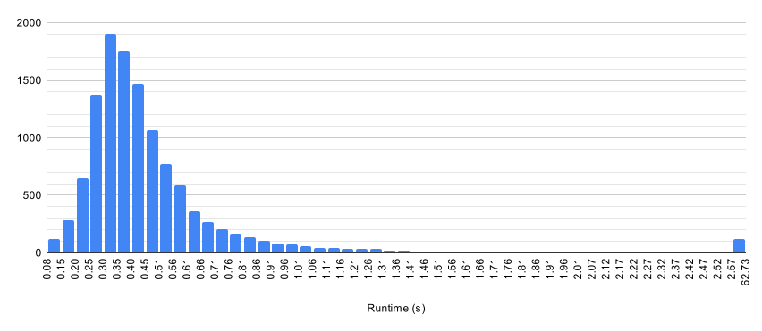

# How fast is CHOpt

CHOpt is now fast enough that I can throw multiple setlists at it, so for fun I
decided to do so and see what results come up. Don't take this too seriously:
for one I only ran this on all these songs once. I did this with CHOpt 1.1.3.

## The songs

I ran CHOpt on every song from the following setlists and packs with Expert
Lead Guitar, except Classical Thump, Imagine, and Space Cowboy for which I did
Expert Bass.

* Angevil Hero II
* Anti Hero
* Anti Hero: Beach Episode
* Anti Hero: Beach Episode - The Beach Sides
* Anti Hero 2
* Band Hero
* Blanket Statement
* Brand New Hero
* Carpal Tunnel Hero: Remastered
* Carpal Tunnel Hero 2
* CHARTS
* CHARTS 2
* CHARTS 2 DLC (Pack 1)
* Circuit Breaker
* Cow Hero
* CSC Monthly Packs (June 2018 - November 2020)
* DF Discography CH
* Digitizer
* Dissonance Hero
* DJ Hero
* Djent Hero Collection (Pack #1 - Pack #5)
* DJMax Packs (Pack I - Pack II)
* Facelift (Pack 1)
* Focal Point
* Focal Point 2
* GaMetal Power Pack
* Green Day Rock Band
* Guitar Hero
* Guitar Hero II
* Guitar Hero II DLC
* Guitar Hero Encore: Rocks the 80s
* Guitar Hero III: Legends of Rock
* Guitar Hero III: Legends of Rock DLC
* Guitar Hero: Aerosmith
* Guitar Hero World Tour
* Guitar Hero World Tour DLC
* Guitar Hero: Metallica
* Guitar Hero: Metallica DLC
* Guitar Hero Smash Hits
* Guitar Hero: Van Halen
* Guitar Hero 5
* Guitar Hero 5 DLC
* Guitar Hero: Warriors of Rock
* Guitar Hero: Warriors of Rock DLC
* Guitar Hero On Tour
* Guitar Hero On Tour: Decades
* Guitar Hero On Tour: Modern Hits
* Guitar Hero: Guitar Zero
* Guitar Hero: Guitar Zero DLC (DLC #1 - DLC #9)
* Guitar Hero X
* Koreaboo Hero
* Koreaboo Hero 2
* Lego Rock Band
* Marathon Hero
* Paradigm
* Phase Shift Guitar Project 4
* Redemption Arc
* Rock Band
* Rock Band 2
* Rock Band 3
* Rock Band ACDC Live Track Pack
* Rock Band Blitz
* The Beatles Rock Band
* The Fall of Troy Hero
* Trunks252JM's Classic Charts
* Vortex Hero
* Zero Gravity

If there's a setlist or pack you'd like to see on here, let me know.

## Results

### Overall

The combined runtime was 58m40s. Below is a histogram of the runtime for each
song, with the top 1% combined as outliers.

The 25 slowest songs are as follows:

| Song                                             | Setlist                      | Time (s) |
| ------------------------------------------------ | ---------------------------- | -------- |
| CHARTS 2: Endless Setlist                        | CHARTS 2                     | 49.193   |
| CHARTS: The (almost) Endless Setlist             | CHARTS                       | 30.178   |
| Endless Setlist: The Fall of Troy Hero           | The Fall of Troy Hero        | 18.117   |
| Chezy's Ultimate Solo Experience                 | CHARTS 2                     | 12.427   |
| Uranoid                                          | CHARTS                       | 11.534   |
| The Human Equation                               | Marathon Hero                | 9.093    |
| Catch Thirtythree                                | Djent Hero Collection        | 8.478    |
| Eskapist                                         | Marathon Hero                | 6.414    |
| Automata                                         | Marathon Hero                | 6.304    |
| Eskapist                                         | CHARTS                       | 6.246    |
| Periphery IV: Hail Stan (Full Album)             | CHARTS 2                     | 5.818    |
| Coma Witch (Full Album Chart)                    | CHARTS                       | 5.801    |
| Volition (Full Album Chart)                      | CHARTS                       | 5.638    |
| Extreme Power Metal (Full Album)                 | Guitar Hero: Guitar Zero DLC | 5.119    |
| Nothing More [FULL ALBUM]                        | CSC Monthly Packs            | 5.047    |
| The Future in Whose Eyes? (Full Album)           | CHARTS 2                     | 4.852    |
| Live at Dynamo Open Air 1998 [FULL ALBUM]        | CSC Monthly Packs            | 4.651    |
| That's The Spirit (Full Album Chart)             | CHARTS                       | 4.291    |
| Jane Doe (Full Album)                            | Dissonance Hero              | 4.248    |
| Bloodwork (Full Album Chart)                     | CHARTS                       | 4.146    |
| Time Will Die And Love Will Bury It (Full Album) | Dissonance Hero              | 4.127    |
| Low Teens (Full Album Chart)                     | CHARTS                       | 4.112    |
| Passion of the Heist II                          | CHARTS 2 DLC                 | 3.898    |
| GaMetal Solo Medley                              | GaMetal Power Pack           | 3.878    |
| In the Unlikely Event                            | The Fall of Troy Hero        | 3.842    |

### By Setlist

| Setlist                                    | Number of songs | Total time (s) | Average time (s) |
| ------------------------------------------ | --------------- | -------------- | ---------------- |
| Angevil Hero II                            | 67              | 31.549         | 0.471            |
| Anti Hero                                  | 402             | 208.210        | 0.518            |
| Anti Hero: Beach Episode                   | 127             | 65.359         | 0.515            |
| Anti Hero: Beach Episode - The Beach Sides | 25              | 10.642         | 0.426            |
| Anti Hero 2                                | 365             | 169.924        | 0.466            |
| Band Hero                                  | 65              | 23.527         | 0.362            |
| Blanket Statement                          | 115             | 45.985         | 0.400            |
| Brand New Hero                             | 83              | 30.718         | 0.370            |
| Carpal Tunnel Hero: Remastered             | 104             | 63.804         | 0.614            |
| Carpal Tunnel Hero 2                       | 309             | 173.973        | 0.563            |
| CHARTS                                     | 646             | 339.326        | 0.525            |
| CHARTS 2                                   | 139             | 127.727        | 0.919            | 
| CHARTS 2 DLC                               | 43              | 21.781         | 0.507            |        
| Circuit Breaker                            | 116             | 48.566         | 0.419            |
| Cow Hero                                   | 71              | 28.969         | 0.408            |
| CSC Monthly Packs                          | 862             | 338.361        | 0.393            |
| DF Discography CH                          | 80              | 50.517         | 0.631            |
| Digitizer                                  | 82              | 32.767         | 0.400            |
| Dissonance Hero                            | 106             | 54.627         | 0.515            |
| DJ Hero                                    | 10              | 2.686          | 0.269            |
| Djent Hero Collection                      | 161             | 86.575         | 0.538            |
| DJMax Packs                                | 58              | 17.981         | 0.310            |
| Facelift                                   | 35              | 14.259         | 0.407            |
| Focal Point                                | 170             | 86.817         | 0.511            |
| Focal Point 2                              | 186             | 91.772         | 0.493            |
| GaMetal Power Pack                         | 54              | 27.820         | 0.515            |
| Green Day Rock Band                        | 43              | 15.119         | 0.352            |
| Guitar Hero                                | 49              | 16.186         | 0.330            |
| Guitar Hero II                             | 74              | 26.391         | 0.357            |
| Guitar Hero II DLC                         | 24              | 8.346          | 0.348            |
| Guitar Hero Encore: Rocks the 80s          | 30              | 10.639         | 0.355            |
| Guitar Hero III: Legends of Rock           | 70              | 26.337         | 0.376            |
| Guitar Hero III: Legends of Rock DLC       | 68              | 29.925         | 0.440            |
| Guitar Hero: Aerosmith                     | 41              | 14.488         | 0.353            |
| Guitar Hero World Tour                     | 84              | 32.883         | 0.391            |
| Guitar Hero World Tour DLC                 | 147             | 62.617         | 0.426            |
| Guitar Hero: Metallica                     | 49              | 29.157         | 0.595            |
| Guitar Hero: Metallica DLC                 | 10              | 7.077          | 0.708            |
| Guitar Hero Smash Hits                     | 48              | 19.000         | 0.396            |
| Guitar Hero: Van Halen                     | 47              | 19.915         | 0.424            |
| Guitar Hero 5                              | 84              | 36.060         | 0.429            |
| Guitar Hero 5 DLC                          | 158             | 58.973         | 0.373            |
| Guitar Hero: Warriors of Rock              | 93              | 35.807         | 0.385            |
| Guitar Hero: Warriors of Rock DLC          | 84              | 35.361         | 0.421            |
| Guitar Hero On Tour                        | 31              | 10.592         | 0.342            |
| Guitar Hero On Tour: Decades               | 36              | 11.444         | 0.318            |
| Guitar Hero On Tour: Modern Hits           | 44              | 13.938         | 0.317            |
| Guitar Hero: Guitar Zero                   | 64              | 23.076         | 0.361            |
| Guitar Hero: Guitar Zero DLC               | 38              | 20.651         | 0.543            |
| Guitar Hero X                              | 127             | 72.274         | 0.569            |
| Koreaboo Hero                              | 51              | 15.858         | 0.311            |
| Koreaboo Hero 2                            | 101             | 31.090         | 0.308            |
| Lego Rock Band                             | 45              | 13.521         | 0.300            |
| Marathon Hero                              | 49              | 95.094         | 1.941            |
| Paradigm                                   | 101             | 48.316         | 0.478            |
| Phase Shift Guitar Project 4               | 162             | 74.112         | 0.457            |
| Redemption Arc                             | 100             | 44.451         | 0.445            |
| Rock Band                                  | 58              | 21.711         | 0.374            |
| Rock Band 2                                | 84              | 29.980         | 0.357            |
| Rock Band 3                                | 83              | 29.253         | 0.352            |
| Rock Band ACDC Live Track Pack             | 18              | 8.400          | 0.467            |
| Rock Band Blitz                            | 25              | 8.795          | 0.352            |
| The Beatles Rock Band                      | 45              | 12.127         | 0.269            |
| The Fall of Troy Hero                      | 70              | 60.163         | 0.859            |
| Trunks252JM's Classic Charts               | 56              | 24.224         | 0.533            |
| Vortex Hero                                | 222             | 97.871         | 0.441            |
| Zero Gravity                               | 179             | 74.111         | 0.414            |

## Average Multiplier Outliers

I've started gathering more information when I measure performance, including
average multiplier. The 25 songs with the highest optimal average multiplier are
as follows:

| Song                                          | Setlist                          | Average Multiplier |
| --------------------------------------------- | -------------------------------- | ------------------ |
| Sugar Foot Rag                                | Carpal Tunnel Hero 2             | 7.276x             |
| Trojans                                       | Carpal Tunnel Hero 2             | 7.070x             |
| Downfall of Gaia                              | CSC Monthly Packs                | 6.874x             |
| Gee-Wiz                                       | Carpal Tunnel Hero 2             | 6.824x             |
| Star X Speed Story Solo Medley                | Anti Hero: Beach Episode         | 6.784x             |
| Thunder And Lightning                         | Carpal Tunnel Hero 2             | 6.752x             |
| Dithering                                     | Paradigm                         | 6.751x             |
| Black Hole Sun                                | Rock Band                        | 6.696x             |
| lifeisgood                                    | CHARTS 2                         | 6.658x             |
| All Is One                                    | Vortex Hero                      | 6.572x             |
| Solace                                        | Djent Hero Collection            | 6.554x             |
| This Ain't a Scene, It's an Arms Race         | Guitar Hero On Tour: Modern Hits | 6.467x             |
| Away / Poetic Justice                         | Vortex Hero                      | 6.463x             |
| Christmas Time is Here (Vince Guaraldi cover) | CSC Monthly Packs                | 6.455x             |
| ETERNAL NOW                                   | Paradigm                         | 6.433x             |
| Frankenstein                                  | Guitar Hero II DLC               | 6.432x             |
| Frankenstein                                  | Guitar Hero                      | 6.431x             |
| PN35                                          | CHARTS 2                         | 6.427x             |
| PN35                                          | Circuit Breaker                  | 6.427x             |
| Gamer National Anthem (feat. Coey)            | CSC Monthly Packs                | 6.418x             |
| Neonatalimpalionecrophiliation                | Carpal Tunnel Hero 2             | 6.415x             |
| Trippolette                                   | Guitar Hero                      | 6.366x             |
| Oblivion (Rockin' Night Style)                | DJMax Packs                      | 6.366x             |
| Tapping Boogie                                | Paradigm                         | 6.352x             |
| I'm So Sick                                   | Rock Band                        | 6.345x             |

There are 50 songs that cannot be 7 starred. 34 of them do not have any Star
Power; the 16 that do are as follows:

| Song                                    | Setlist                      | Average Multiplier |
| --------------------------------------- | ---------------------------- | ------------------ |
| All                                     | CSC Monthly Packs            | 1.016x             |
| No, All!                                | CSC Monthly Packs            | 1.095x             |
| They Don't Have To Believe...           | CHARTS                       | 3.594x             |
| Uranoid                                 | CHARTS                       | 4.121x             |
| The Betrayal                            | Carpal Tunnel Hero 2         | 4.267x             |
| Bleed                                   | CHARTS                       | 4.311x             |
| Breakout (feat. Scandroid)              | Phase Shift Guitar Project 4 | 4.332x             |
| Luca (Demo)                             | Brand New Hero               | 4.335x             |
| Coffee Mug (Originally by Descendents)  | CHARTS                       | 4.335x             |
| Shards of Scorched Flesh                | Carpal Tunnel Hero 2         | 4.349x             |
| Cascading Failures, Diminishing Returns | Carpal Tunnel Hero 2         | 4.366x             |
| Built This Pool (blink-182 Cover)       | CHARTS                       | 4.368x             |
| The Pretender                           | Paradigm                     | 4.378x             |
| Infinitesimal to the Infinite           | Zero Gravity                 | 4.382x             |
| Get Possessed                           | Anti Hero                    | 4.386x             |
| Monkey Wrench                           | Guitar Hero II               | 4.400x             |

Note the average multiplier for Monkey Wrench is rounding from 4.39995x. Clone
Hero would display the average multiplier as 4.400x, but 5 more points would be
needed for the 7 star.
